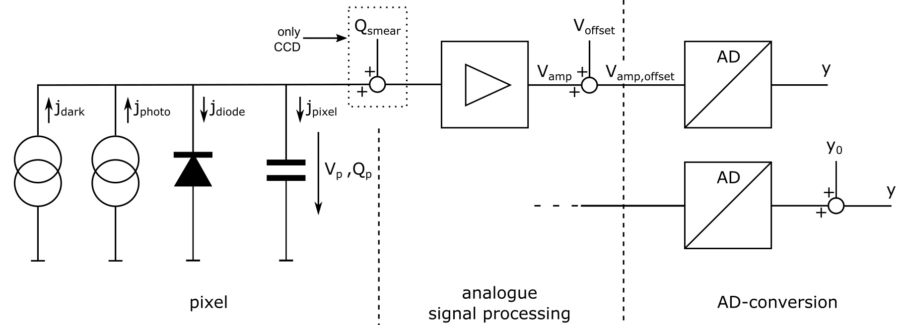
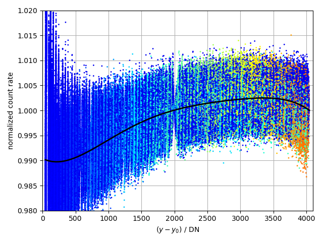

Introduction
============

To determine the non-linearity of a imaging device with charge accumulating
sensor (camera, array spectrometer), a system model has to be set up to define
sources of non-linearity and attribute them to parts of the system. Then
internal quantities have to be named, that define the operating point of the
system's part and therefore relate to a specific non-linearity.

System model of the sensor
--------------------------

:numref:`pixel_equiv_circ` shows the equivalent circuit diagram of a sensor.
The left half represents the pixel which generates and accumulates charges
corresponding to the incident light. The right half represents the signal
processing of the accumulated charges which are charge transport (for CCD),
amplification of analogue signals and AD-conversion.

.. _pixel_equiv_circ:

    Equivalent circuit diagram of a sensor

Sources of Non-Linearity
------------------------

Three main sources of non-linearity could be identified:

1. **Generation of charges:** The photonic current $i_{\mathrm{phot}}$ can
   depend not only on the intensity of the incoming light but also on the
   combination of wavelength and the amount of accumulated charges.

2. **Accumulation of charges:** The exponential part of the systems equation.
   Assuming that  $C_\mathrm{p}$, $i_\mathrm{S}$ and $n$ are constant, it's
   operating point is defined by the pixel voltage. Because of the exponential
   growths of this nl component over time, it may be only relevant for very
   long integration times (> some seconds). 

3. **Transformation of accumulated charges to digital signal:** 
   The components signal processing chain that transform the number of charges
   into a digital signal may have an non-ideal transfer function.  The
   operating point for this chain is defined by it's input $q_\mathrm{p}$. This
   requires that other parameters like amplification factors, bias voltages and
   compensation settings are fixed. This component covers all measured signals
   and therefore has to be determined first. 

.. _spectral_dependency:

Generation of charges - Spectral dependency 
~~~~~~~~~~~~~~~~~~~~~~~~~~~~~~~~~~~~~~~~~~~

The photonic current $i_{\mathrm{phot}}$ can depend not only on the intensity of
the incoming light but also on the combination of wavelength and the amount of
accumulated charges. Light with short wavelength has only a small penetration
depth into the silicon but longer wavelenths lead to larger penetration depth. 
This leads to differenz zones of charge generation. In combination with changing
electrical fields inside the pixel, this can lead to a change in the effective
charge generation rate or quantum efficiency. :numref:`nonlin_over_wl` shows an
example of this depencency. It shows the measured non-linearities for different
wavelengths from UV to IR as an example. Between 350nm and 500nm the change of
the non-linearities is dominated by noise. But above 500nm the curves start to
tilt. :numref:`slope_over_wl` shows the change of the linear component of the 
curve. This simple tilting can not be generalized and is specific to this
sensor!

.. _nonlin_over_wl:

    Wavelength dependency of non-linearity

.. _slope_over_wl:

    Wavelength dependency of non-linearity, Slope

Accumulation of charges
~~~~~~~~~~~~~~~~~~~~~~~

The pixel can be modeled as the combination of an ideal diode, parallel to a
capacitor, which models the pixel's internal capacity, and two parallel current
sources  One source for charges generated by thermal motion (dark current
$i_{\mathrm{thermal}}$) and one for the charges generated by incident light
($i_{\mathrm{phot}}$). These currents charge the pixel's capacity
$C_\mathrm{p}$. The diode adds a discharge current $i_{\mathrm{diode}}$ that
reduces the number of accumulated charges. It is a function of the voltage over
the diode $V_\mathrm{p}$ which follows from the accumulated charges
$q_\mathrm{p}$ and $C_\mathrm{p}$ and can be modeled by Shockley-equation. The
pixel current equals to:  

.. math::
   :label: eq_diode_current

    i_\mathrm{p} &= i_\mathrm{thermal} + i_\mathrm{phot} - i_\mathrm{S}(\exp(\frac{V_\mathrm{p}}{n \cdot V_\mathrm{T}}) - 1) \\
    i_\mathrm{p} &= i_\mathrm{thermal} + i_\mathrm{phot} - i_\mathrm{S}(\exp(\frac{q_\mathrm{p}}{n \cdot V_\mathrm{T} \cdot C_\mathrm{p}}) - 1)

* $i_\mathrm{p}$ : pixel current
* $V_\mathrm{p}$ : pixel voltage
* $q_\mathrm{p}$ : accumulated charge 
* $C_\mathrm{p}$ : pixel capacity
* $i_\mathrm{S}$ : reverse bias saturation current
* $V_\mathrm{T}$ : thermal voltage ($kT/q$, ~26-30mV)
* $n$ : ideality factor (1$\ldots$2)

The pixel voltage $V_\mathrm{p}$ is given by :math:`q_\mathrm{p} /
C_\mathrm{p}`, the ratio of accumulated charge and the pixel capacity.  Because
$i_\mathrm{p}$ is the time derivative of $q_\mathrm{p}$, :eq:`eq_diode_current`
is the pixel's differential equation. 

For time constant illumination and thermal conditions the currents
$i_\mathrm{phot}$ and $i_\mathrm{thermal}$ should be constant. That means
that the time integral of these currents raises linear with the integration
time. This is the expected ideal pixel behavior.

:numref:`diode-v-i-characteristic` shows the V-I-diagram of the pixel diode.
When we presume that no bias voltage is applied, the operating point starts at
the short circuit point with $V_\mathrm{D}=0$ and moves along the curve, with
increasing voltage and decreasing current until it reaches the open loop point
where the incoming currents $i_{\mathrm{phot}}$ and $i_{\mathrm{thermal}}$ are
in equilibrium with the outgoing current $i_{\mathrm{diode}}$ and the pixel
voltage reaches a stationary saturation value.

.. _diode-v-i-characteristic:
.. figure:: images//diode-v-i-characteristic.png
    :scale: 100 %
    :alt: V-I-characteristic of a photo diode

    V-I-characteristic of a photo diode

The following assumptions apply to this model:

* The exponential part for the 4th quadrant of the diode's V-I characteristic.
  So no bias voltage is applied. 
  .. todo:: how to handle bias voltage 
* Higher order effects like resistances or capacities are neglectable. 
  
Transformation of accumulated charges to digital signal
~~~~~~~~~~~~~~~~~~~~~~~~~~~~~~~~~~~~~~~~~~~~~~~~~~~~~~~

The accumulated charges $q_\mathrm{p}$ get transformed to a voltage and
amplified. Then this voltage is shifted by adding an offset voltage
$V_\mathrm{AD}$ to ensure that the noisy signal alway is positive and does not
get clipped by the following AD converter. 

.. math::
        :label: eq_count_signal_1

        y = k_1 k_2 \int_0^t i_\mathrm{thermal} + i_\mathrm{phot} - j(exp(...)-1) dt + V_0 k_2 \\ 

$k_1$ and $k_2$ are the overall gain factors for the analogue part and the AD
conversion respectively. $V_0$ is not accessible from outside but we can replace
$V_0\cdot k_2$ by the resulting count value $y_0$ which can be determined as the
signal limit when the integration time approaches 0 ($y_0 = \lim \limits_{t \to
0} y$, without illumination to suppress smear effect).

For the integral part of :eq:`eq_count_signal_1` the gain factors $k_1 k_2$
can be combined to $k_0$ for an ideal system or :math:`k_0 k_\mathrm{rel}` for 
an non-ideal system. Here, $k_0$ is the reference gain (e.g. average gain or
gain for a chosen reference point) and $k_\mathrm{rel}$ is a relative change to $k_0$,
the non-linearity of the signal-processing chain. With this we get: 

.. math::
        :label: eq_count_signal_2

        y = k_0 k_\mathrm{rel} \left( (i_\mathrm{thermal} + i_\mathrm{phot}) \cdot t - \int_0^t j(exp(...)-1) dt \right) + y_0
        

**Remark:** This model is intended to be able to cover the main sources of
non-linearity of charge-accumulating sensors, not to simulate them on circuit
level. Sensor internal procedures like charge transport (CCD,
Correllated-Double-Sampling or Optical-Black-Clamping are not considered. The
model shall (?) facilitate end users to characterize the non-linearity of a
camera but they usually don't have information about camera internals and are
not able to apply test signals to parts of the system.

Procedure to determine components of non-linearity
--------------------------------------------------

To determine the non-linearity, the camera has to be excited by a known input
and the camera's output values have to be observed. The possibilities for this
are limited. The only inputs that can always be applied are the incoming light /
irradiance, it's wavelength and the integration time. 

The basic procedure to determine the non-linearity is:

- Take a series of measurements of a scene with timewise constant illumination and vary the
  integration time from the lowest possible ones up to those where all
  evaluated pixel reach saturation or the limit of the AD-converter. 
  This gives for each pixel a series of $y_i$ for each integration time $t_i$.
  
- Take a series of measurements with no illumination (shutter, lens cap) and
  integration time from the lowest possible ones up to some milli seconds.
  With these values $y_0$ can be determined by linear regression.  For an ideal
  system the AD-offset $y_0$ should be constant for all pixel but it shows that
  it often varies between pixels. This reveals limitations of this model but
  this can be handled by calculating an inidivdual $y_0$ for each pixel.

- For short $t_i$ the exponential component of  
  :eq:`eq_count_signal_2` gets neglectable and with this  :eq:`eq_count_signal_2`
  can be reformulated to 

  .. math::
     :label: eq_count_signal_3

     r_i = \frac{y_i-y_0}{t_i} = \frac{y_i^*}{t_i} = k_0 k_\mathrm{rel}\cdot(i_\mathrm{thermal} + i_\mathrm{phot})

  $r_i$ is the count rate at the $i$-th measurement. 
  To simplify the writing we introduce the counts :math:`y_i` reduced by
  :math:`y_0` as $y^*$. $k_\mathrm{rel}$ is a function of $y_i^*$. To
  eliminate $k_0$ we choose a reference count value for $y_\mathrm{ref}$ from
  these $y^*$ where :math:`k_\mathrm{rel}(y_\mathrm{ref})` is defined to be 1
  and devide :eq:`eq_count_signal_3` by $r_\mathrm{ref}$:

  .. math::
     :label: eq_count_signal_4

     r_{\mathrm{n},i} = \frac{r_i}{r_\mathrm{ref}} = \frac{k_0  k_\mathrm{rel}(y_i^*)\cdot(i_\mathrm{thermal} + i_\mathrm{phot})}{k_0\cdot(i_\mathrm{thermal} + i_\mathrm{phot})} =  k_\mathrm{rel}(y_i^*)

  Because the individual illuminances and sensitivities of each pixel cancel
  out, this normalized count rate $r_{\mathrm{n},i}$ is the non-linearity
  $k_\mathrm{rel}$, defined over $y_i^*$.

- This evaluation and normalization is done for every pixel. The tuple of
  $y_i^*$ and $r_{\mathrm{n},i}$ are collected and an appropriate function can
  be fitted into these data to describe the average non-linearity in a closed
  form. Common classes for this functions are polynoms of n-th grade or
  c-splines.  This function has to be adjusted to the specific distribution of
  the non-linearity data points.

:numref:`nl_example_1` and :numref:`nl_example_2` show two examples of the
generated non-linearity data.  The data points are the $r_{\mathrm{n},i}$ for
multiple pixels and some integtration-time series. The reference point
$y_\mathrm{ref}$  is 2000.  The integration time is encoded in the color, blue
for short integration times, red for the maximum possible integration time.
For the longer integration time the data points go slightly down below the blue
ones which is this exponential non-linearity component but here it is to low to
be modelled seperately

.. _nl_example_1:

   Example for non-linearity, Camera A, color of data points represents integration time

.. _nl_example_2:

    
   Example for non-linearity, Camera B, color of data points represents integration time

In :numref:`nl_example_3b` an example for a array spectrometer is shown where
this exponential non-linearity is larger and can not be neglected. To make the
difference more visible, :numref:`nl_example_3a` shows only the data points
with short integration times. Compared to this, the left side is broader
because the left part of the high-int.time series, despite beeing imaged as
blue, has higher integration times than the right side of the low-int.time
series. This means, when the high-int.time series reach the reference point a
significant amount of charges has been lost by $i_\mathrm{p}$. Because of this
the curve "rotates" around the reference point the data points on the left side
move up slightly.  by normalizing to the reference point  From this follows
that the effective difference of the non-linearities is getting larger at the
right end when the left end is scaled to the same start point and slope. 

.. _nl_example_3a:

    
   Example for non-linearity, Array Spectrometer, only short integration times

.. _nl_example_3b:

    
   Example for non-linearity, Array Spectrometer, short and long integration times

Order of Determination of NL-Components
---------------------------------------

At first, the non-linearity of the signal-processing chain has to be
determined.  This can be achieved by illuminating with blue light to minimize
spectral effects (see :ref:`spectral_dependency`) and a luminance / illuminance
at a level that the integration time is small enough that no relevant
exponential discharge occurs (< 1s).

Then the spectral dependency is determined by repeating this measurement with
light of different wavelength, at least green and red to see if there is a
spectral dependency. By dividing the measured non-linearities by the sigproc-nl
it can be compensated to get the spectral effect.

.. todo:: How to estimate effective NL for a given spectrum?

The third step is to check if there is a relevant exponential discharge 
for long integration times. 

Requirements:

- relative timing with high accuracy
- system has to report realized integration time -> possible discrepancy between set value and realized one.
- internal settings need to be constant, eg. bias voltage, offset voltage, pixel clock...

.. todo::
        - determine modelparameters for exponential nl
        - compensation of nl 

